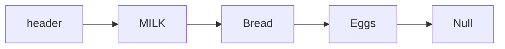
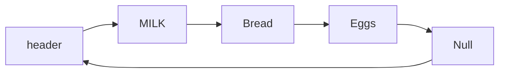

# javascript 中的数据结构和算法

## 时间复杂度[引用](https://www.cnblogs.com/yuqing6/p/10785440.html)

- 定义： 时间复杂度（Time complexity）是一个函数，它定性描述该算法的运行时间。这是一个代表算法输入值的字符串的长度的函数. 时间复杂度常用大 O 表述，不包括这个函数的低阶项和首项系数

- 常见时间复杂度：

  - O(1)【常数】：无论数据规模 n 如何增长，计算时间是不变的， 即不管如何执行，代码执行时间都是固定的

  ```js
  const add = (n) => n + 1; // n无论如何增加， 计算时间都是不变的，
  ```

  - O(logN)

  ```js
  function fn(n) {
    let i = 1;
    while (i < n) {
      i *= 2;
    }
  }
  ```

  - O(n)： 线性复杂度，着数据规模 n 的增，计算时间也会随着 n 线性增

  ```js
  function fn(n) {
    for (let i = 0; i < n; i++) {
      console.log(i);
    }
  }
  ```

- 排序：O(1) < O(lgn) < O(n) < O(nlgn) < O(n^2) < O(n^3) < O(2^n) < O(n!)

## 空间复杂度[引用](http://t.zoukankan.com/GarfieldEr007-p-12251700.html)

- 定义： 算法运行时所占用的临时存储空间
  一个算法执行期间所占用的存储量分为三部分：

  - 算法本身的代码所占用的空间
  - 输入数据所占用的空间
  - 辅助变量所占用的空间
    由于实现不同算法所需的代码不会有数量级的差别，所以算法本身代码所占用的空间我们可以不考虑
    输入的数据所占用的空间是由问题决定的，与算法无关，所以我们也不需要考虑
    我们需要考虑的只有一个：程序执行期间，辅助变量所占用的空间。
    计算方法类似于计算算法的时间复杂度，空间复杂度我们用 S(n) 来表示，它同样是输入数据规模 n 的函数，用大 O 表示法记为：

  S(n) = O(g(n))
  其中 g(n) 是一个关于 n 的函数，如：g(n) = n、g(n) = n^2、g(n) = log2N 等等

## 数组

### JavaScript 中对数组的定义

数组的标准定义是：一个存储元素的线性集合（collection），元素可以通过索引来任意存
取，索引通常是数字，用来计算元素之间存储位置的偏移量。几乎所有的编程语言都有类
似的数据结构。然而 JavaScript 的数组却略有不同。
JavaScript 中的数组是一种特殊的对象，用来表示偏移量的索引是该对象的属性，索引可
能是整数。然而，这些数字索引在内部被转换为字符串类型，这是因为 JavaScript 对象中
的属性名必须是字符串。数组在 JavaScript 中只是一种特殊的对象，所以效率上不如其他
语言中的数组高。
JavaScript 中的数组，严格来说应该称作对象，是特殊的 JavaScript 对象，在内部被归类为数
组。由于 Array 在 JavaScript 中被当作对象，因此它有许多属性和方法可以在编程时使用

### 存取函数

#### 查找元素

- `indexOf`: 如果目标数组包含该参数，就返回该元素在数组中的索引；如果不包含，就返回 -1【如果数组中包含多个相同的元素，indexOf() 函数总是返回第一个与参数相同的元素的索
  引】
- `lastIndexOf`：返回相同元素中最后一个元素的索引，如果没找到相同元素，则返回 -1

#### 数组的字符串表示

- `join`:返回一个包含 数组所有元素的字符串，各元素之间用逗号分隔开
- `toString`:返回一个包含数组所有元素的字符串，各元素之间用逗号分隔开

#### 由已有数组创建新数组

- `concat`
- `splice`

### 可变函数

#### 添加元素

- `push`:将一个或多个元素添加到数组末尾：【返回数组的长度】
  ```js
  let num = [1, 2, 3];
  num.push(1, 2, 3);
  num.push(...[1, 2, 3]);
  ```
- `unshift`:将一个或多个元素添加到数组开头：【返回数组的长度】
  ```js
  let num = [1, 2, 3];
  num.unshift(1, 2, 3);
  num.unshift(...[1, 2, 3]);
  ```

#### 删除元素

- `pop`:使用 pop() 方法可以删除数组末尾的元素【返回删除的元素】
- `shift`:shift() 方法可以删除数组的第一个元素【返回删除的元素】

#### 数组中间位置添加或者删除元素

splice() 方法为数组添加元素，需提供如下参数：

- 起始索引（也就是你希望开始添加元素的地方）；
- 需要删除的元素个数（添加元素时该参数设为 0）；
- 想要添加进数组的元素。

#### 数组排序

- `reverse`: 该方法将数组中元素的顺 序进行翻转
- `sort`: 数组排序

  - 元素是字符串类型
    ```js
    let num = ["a", "c", "d", "b"];
    num.sort(); //  ['a', 'b', 'c', 'd']
    ```
  - 元素是数字类型
    ```js
    let num = [3, 1, 2, 100, 4, 200];
    num.sort(); //  [1, 100, 2, 200, 3, 4]
    ```
  - 通过传入函数控制排序大小

  ### 迭代器方法

  #### 不生成新数组的迭代器方法

  - `forEach`:该方法接受一个函数作为参数，对数组中的每个元素使用该函数

  - `every`:该方法接受一个返回值为布尔类型的函数，对数组中的每个元素使用该函数。如果对于所有的元素，该函数均返回 true，则该方法返回 true
  - `some`: 也接受一个返回值为布尔类型的函数，只要有一个元素使得该函数返回 true， 该方法就返回 true
  - `reduce`:接受一个函数，返回一个值。该方法会从一个累加值开始，不断对累加值和数组中的后续元素调用该函数，直到数组中的最后一个元素，最后返回得到的累加值。
    ```js
    const num = [1, 2, 3, 4];
    const total1 = num.reduce((total, current, idx) => total + current); // 10  循环3次
    const total2 = num.reduce((total, current, idx) => total + current, 1); // 11  循环4次
    ```
    **<font color="red">注意</font>**：如果没有提供 initialValue，reduce 会从索引 1 的地方开始执行 callback 方法，跳过第一个索引。如果提供 initialValue，从索引 0 开始

  #### 生成新数组的迭代器方法

  - `map`:对数组中的每个元素使用某个函数,返回一个新的数组
  - `filter`:传入一个返回值为布尔类型的函数,返回一个新数组，该数组包含应用该函数后结果为 true 的元素

  #### 多维数组

  - 多维数组的创建

  ```js
  Array.prototype.matrix = function (rows, cols, initial) {
    let arr = [];
    for (let i = 0; i < rows; i++) {
      let columns = [];
      for (let j = 0; j < cols; j++) {
        columns[j] = initial;
      }
      arr[i] = columns;
    }
    return arr;
  };
  ```

## 栈

### 操作

- 定义：栈是一种特殊的列表，栈内的元素只能通过列表的一端访问，是一种后入先出（LIFO，last-in-first-out）的数据结构

### js 实现

```js
function Stack() {
  this.dataStore = [];
  this.top = 0;
  this.push = function (ele) {
    this.dataStore[this.top++] = ele;
  };
  this.pop = function () {
    return this.dataStore[--this.top];
  };
  this.peek = function () {
    return this.dataStore[this.top - 1];
  };
  this.clear = function () {
    this.top = 0;
    this.dataStore = [];
  };
  this.length = function () {
    return this.top;
  };
}

const stack = new Stack();

console.log(stack.push("a"));
console.log(stack.push("b"));
console.log(stack.length()); // 2
console.log(stack.pop()); // b
console.log(stack.pop()); // a

module.exports = Stack;
```

### 应用

#### 数制间的相互转换

可以利用栈将一个数字从一种数制转换成另一种数制。假设想将数字 n 转换为以 b 为基数
的数字，实现转换的算法如下。
(1) 最高位为 n % b，将此位压入栈。
(2) 使用 n/b 代替 n。
(3) 重复步骤 1 和 2，直到 n 等于 0，且没有余数。
(4) 持续将栈内元素弹出，直到栈为空，依次将这些元素排列，就得到转换后数字的字符
串形式。
【此算法只针对基数为 2~9 的情况】

```js
const Stack = require("./stack.js");
function mulBase(num, base) {
  const stack = new Stack();
  do {
    stack.push(num % base);
    num = Math.floor((num /= base));
  } while (num > 0);
  console.log(stack.getStack());
  let converted = "";
  while (stack.length() > 0) {
    converted += stack.pop();
  }
  return converted;
}
```

#### 回文处理

```js
const Stack = require("./stack.js");

function isPalindrome(word) {
  word = word + "";
  if (!word) return;
  const stack = new Stack();
  for (let i = 0; i < word.length; i++) {
    stack.push(word[i]);
  }
  let words = "";
  while (stack.length() > 0) {
    words += stack.pop();
  }
  console.log(words, word);
  return words === word;
}

console.log(isPalindrome("121")); // true

console.log(isPalindrome(121)); // true
```

#### 练习

- 栈可以用来判断一个算术表达式中的括号是否匹配。编写一个函数，该函数接受一个算 术表达式作为参数，返回括号缺失的位置。下面是一个括号不匹配的算术表达式的例子：`2.3 + 23 / 12 + (3.14159×0.24`

  ```js
  function getMatch(str) {
    str += "";
    if (!str) return;
    const stack = new Stack();
    for (let index = 0; index < str.length; index++) {
      if (str[index] === "(") {
        stack.push(index);
      }
      if (str[index] === ")") {
        stack.pop(index);
      }
    }
    return stack.length() ? stack.pop() + 1 : true;
  }

  const str = "2.3 + 23 / 12 + (3.14159×0.24";
  console.log(getMatch(str)); // 17
  ```

  假设括号都是匹配的， 越靠后的左括号，对应的右括号越靠前，那就左括号入栈，有括号出栈

  - [力扣](https://leetcode.cn/problems/valid-parentheses)给定一个只包括 '('，')'，'{'，'}'，'['，']'  的字符串 s ，判断字符串是否有效。
    有效字符串需满足：
    左括号必须用相同类型的右括号闭合。
    左括号必须以正确的顺序闭合。
    每个右括号都有一个对应的相同类型的左括号。

    ```js
    /**
     * @param {string} s
     * @return {boolean}
     */

    var isValid = function (s) {
      if (s.length % 2 === 1) return false;
      const stack = [];
      for (let i = 0; i < s.length; i++) {
        console.log(i, 123);
        if (["(", "{", "["].includes(s[i])) {
          stack.push(s[i]);
        } else {
          const last = stack[stack.length - 1];
          if (
            (last === "(" && s[i] === ")") ||
            (last === "{" && s[i] === "}") ||
            (last === "[" && s[i] === "]")
          ) {
            stack.pop();
          } else {
            return false;
          }
        }
      }
      return !stack.length;
    };
    ```

## 队列

队列是一种先进先出（First-In-First-Out，FIFO）的数据结构，只能在队尾插入元素，在队首删除元素

### js 实现

队列对于 js 来说本质还是用的数组，只不过是对数组进行了相应的包装， 提供出各种方法

```js
function Queue() {
  this.dataStore = [];
  this.enqueue = function (ele) {
    return this.dataStore.push(ele);
  };
  this.dequeue = function () {
    return this.dataStore.shift();
  };
  this.front = function () {
    return this.dataStore[0];
  };
  this.back = function () {
    return this.dataStore[this.dataStore.length - 1];
  };
  this.toString = function (s = " ") {
    return this.dataStore.join(s);
  };
  this.empty = function () {
    return !this.dataStore.length;
  };
  this.getDataStore = function () {
    return this.dataStore;
  };
}
```

### 使用队列对数据进行排序

> 基数排序: 是一种非比较型整数排序算法，其原理是将整数按位数切割成不同的数字，然后按每个位数分别比较

代码实现：当前代码只能实现小于 100 的整数排序

```js
const Queue = require("./queue.js");

let list = [];
for (var i = 0; i < 10; ++i) {
  list[i] = Math.floor(Math.floor(Math.random() * 101));
}

//  生成 0-9 的9个队列
const queues = [];
for (var i = 0; i < 10; ++i) {
  queues[i] = new Queue();
}
/**
 * 将数据根据位数进行排序
 * @param {number[]} nums  需要排序的数组
 * @param {Array} queues
 * @param {*} digit  // 当前的位数 【个位 十位 百...】
 * @return  {number[]} 排序后的数据
 */
function distribute(nums, queues, digit) {
  for (let i = 0; i < nums.length; i++) {
    //  个位
    if (digit === 1) {
      queues[nums[i] % 10].enqueue(nums[i]);
    } else {
      queues[Math.floor(nums[i] / 10)].enqueue(nums[i]);
    }
  }
}

// 收集某位排序号的数字
function collect(queues, nums) {
  let i = 0;
  for (let digit = 0; digit < 10; digit++) {
    while (!queues[digit].empty()) {
      nums[i++] = queues[digit].dequeue();
    }
  }
}

console.log("排序前", list.join(" "));
distribute(list, queues, 1);
collect(queues, list);
distribute(list, queues, 10);
collect(queues, list);
console.log("排序后", list.join(" "));
```

将上面的代码改造下，改成支持整数排序

```js
const Queue = require("./queue.js");

/**
 * 对数组中的数字进行排序
 * @param {<number>Array} arr
 * @returns 返回排序后的数组
 */
function sort(arr = []) {
  if (!Array.isArray(arr)) throw Error("参数必须是数组");
  if (!arr.length) return arr;
  //寻找出最大值的位数
  const maxLength = String(Math.max(...arr));

  //  生成 0-9 的9个队列
  const queues = [];
  for (var i = 0; i < 10; ++i) {
    queues[i] = new Queue();
  }
  /**
   * 将数据根据位数进行排序
   * @param {number[]} nums  需要排序的数组
   * @param {Array} queues
   * @param {*} digit  // 当前的位数 【个位 1 十位 10  百 100 ...】
   * @return  {number[]} 排序后的数据
   */
  function distribute(nums, queues, digit) {
    for (let i = 0; i < nums.length; i++) {
      //  个位
      if (digit === 1) {
        queues[nums[i] % 10].enqueue(nums[i]);
      } else {
        let j = Math.floor(nums[i] / digit);
        while (j >= 10) {
          j %= 10;
        }
        queues[j].enqueue(nums[i]);
      }
    }
  }

  // 收集某位排序号的数字
  function collect(queues, nums) {
    let i = 0;
    for (let digit = 0; digit < 10; digit++) {
      while (!queues[digit].empty()) {
        nums[i++] = queues[digit].dequeue();
      }
    }
  }
  // 根据最大值位数判断执行次数
  function forFn(num) {
    console.log("排序前", arr.join(" "));
    let unit = 1;
    while (num > 0) {
      distribute(arr, queues, unit);
      collect(queues, arr);
      unit *= 10;
      num--;
    }
    console.log("排序后", arr.join(" "));
  }
  forFn(maxLength);
}

let list = [20, 5, 0, 110, 3, 7000, 1234, 48, 50, 11111111];

sort(list);

// 排序前 20 5 0 110 3 7000 1234 48 50 11111111
// 排序后 0 3 5 20 48 50 110 1234 7000 11111111
```

## 链表

### 数组的缺点

> JavaScript 中数组的主要问题是，它们被实现成了对象，与其他语言（比如 C++ 和 Java）的数组相比，效率很低（请参考 Crockford 那本书的第 6 章）

### 链表

> 链表是由一组节点组成的集合。每个节点都使用一个对象的引用指向它的后继。指向另一> 个节点的引用叫做链

<!-- https://www.cnblogs.com/mrxiaobai-wen/p/14215875.html 流程图 -->



### 设计一个基于对象的单向链表

```js
//  实现一个链表，要有 插入节点，删除节点，显示列表元素的方法

/**
 * 创建节点的类
 * @param {any} element 节点
 */
function Node(element) {
  this.element = element;
  this.next = null;
}

/**
 * 链表创建
 */
function LinkList() {
  this.head = new Node("head");
  // 找到当前节点
  this.find = function (item) {
    let currNode = this.head;
    while (currNode.element != item) {
      currNode = currNode.next;
    }
    return currNode;
  };
  this.insert = function (newElement, item) {
    const newNode = new Node(newElement);
    const current = this.find(item);
    newNode.next = current.next;
    current.next = newNode;
  };

  this.display = function () {
    let currNode = this.head;
    while (currNode.next !== null) {
      console.log(currNode.next.element);
      currNode = currNode.next;
    }
  };
  // 找到当前节点的上一个节点
  this.findPrevious = function (item) {
    let currNode = this.head;
    while (currNode.element != null && currNode.next.element !== item) {
      currNode = currNode.next;
    }
    return currNode;
  };
  // 删除摸个节点
  this.remove = function (item) {
    const prevNode = this.findPrevious(item);
    if (prevNode.next != null) {
      prevNode.next = prevNode.next.next;
    }
  };
}

var cities = new LinkList();
cities.insert("Conway", "head");
cities.insert("Russellville", "Conway");
cities.insert("Carlisle", "Russellville");
cities.insert("Alma", "Carlisle");
cities.display();
console.log();
cities.remove("Carlisle");
cities.display();
// Conway
// Russellville
// Carlisle
// Alma

// Conway
// Russellville
// Alma
```

### 双向链表

前后可以同时遍历的链表


```js
/**
 * 创建节点的类
 * @param {any} element 节点
 */
function Node(element) {
  this.element = element;
  this.next = null;
  this.previous = null;
}

/**
 * 双向链表创建
 */
function LinkList() {
  this.head = new Node("head");
  // 找到当前节点
  this.find = function (item) {
    let currNode = this.head;
    while (currNode.element != item) {
      currNode = currNode.next;
    }
    return currNode;
  };
  this.insert = function (newElement, item) {
    const newNode = new Node(newElement);
    const current = this.find(item);
    newNode.next = current.next;
    newNode.previous = current;
    current.next = newNode;
  };

  this.display = function () {
    let currNode = this.head;
    while (currNode.next !== null) {
      console.log(currNode.next.element);
      currNode = currNode.next;
    }
  };
  this.dispReverse = function () {
    let currNode = this.findLast();
    while (currNode.previous !== null) {
      console.log(currNode.element);
      currNode = currNode.previous;
    }
  };
  // 删除摸个节点
  this.remove = function (item) {
    const currNode = this.find(item);
    if (currNode.next !== null) {
      currNode.previous.next = currNode.next;
      currNode.next.previous = currNode.previous;
      currNode.next = null;
      currNode.previous = null;
    }
  };
  // 查找最后的节点
  this.findLast = function () {
    let currNode = this.head;
    while (currNode.next !== null) {
      currNode = currNode.next;
    }
    return currNode;
  };
}

var cities = new LinkList();
cities.insert("Conway", "head");
cities.insert("Russellville", "Conway");
cities.insert("Carlisle", "Russellville");
cities.insert("Alma", "Carlisle");
cities.display();
console.log();
cities.remove("Carlisle");
cities.dispReverse();

// Conway
// Russellville
// Carlisle
// Alma

// Alma
// Russellville
// Conway
```

[对应测试代码](https://gitee.com/sky__bear/vue-press-demo/blob/master/base/javascript%E4%B8%AD%E7%9A%84%E6%95%B0%E6%8D%AE%E7%BB%93%E6%9E%84%E5%92%8C%E7%AE%97%E6%B3%95/LList/LListBoth.js)

### 循环列表

循环列表只是在创建节点时将 next 属性指向它本身



```js {8}
// 循环列表
/**
 * 创建节点的类
 * @param {any} element 节点
 */
function Node(element) {
  this.element = element;
  this.next = null;
}

/**
 * 单向链表创建
 */
function LinkList() {
  this.head = new Node("head");
  this.head.next = this.head;
  // 找到当前节点
  this.find = function (item) {
    let currNode = this.head;
    while (currNode.element != item && currNode.next.element !== "head") {
      currNode = currNode.next;
    }
    return currNode;
  };
  this.insert = function (newElement, item) {
    const newNode = new Node(newElement);
    const current = this.find(item);
    newNode.next = current.next;
    current.next = newNode;
  };

  this.display = function () {
    let currNode = this.head;
    while (currNode.next !== null && currNode.next.element !== "head") {
      console.log(currNode.next.element);
      currNode = currNode.next;
    }
  };
  // 找到当前节点的上一个节点
  this.findPrevious = function (item) {
    let currNode = this.head;
    while (currNode.element != null && currNode.next.element !== item) {
      currNode = currNode.next;
    }

    return currNode;
  };
  // 删除摸个节点
  this.remove = function (item) {
    const prevNode = this.findPrevious(item);
    if (prevNode.next != null) {
      prevNode.next = prevNode.next.next;
    }
  };
}

var cities = new LinkList();
cities.insert("Conway", "head");
cities.insert("Russellville", "Conway");
cities.insert("Carlisle", "Russellville");
cities.insert("Alma", "Carlisle");
cities.display();
console.log("---");
cities.remove("Carlisle");
cities.display();
console.log("---");
cities.findPrevious("Conway");
cities.findPrevious("Russellville");
```

## 字典

> 字典是一种以键 - 值对形式存储数据的数据结构
> 这个没啥好说的，就这样吧

## 散列

> 散列是一种常用的数据存储技术，散列后的数据可以快速地插入或取用。散列使用的数据
> 结构叫做散列表
