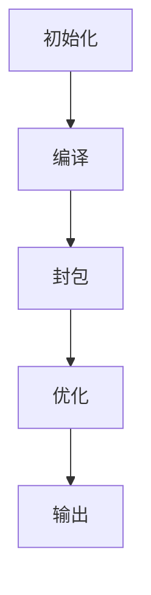

# 前端构建工具深入解析

## 包管理器部分

### npm安装过程解析
1. 说明npm在安装一个包时到底经历了什么过程？

npm安装包的过程可以分为以下几个关键步骤：

1. **解析依赖**：
   - 读取项目中的package.json文件
   - 构建依赖树，处理版本范围声明(如^, ~等)
   - 检查是否存在package-lock.json或npm-shrinkwrap.json

2. **获取包信息**：
   - 向npm registry发送请求获取包元数据
   - 解析包的依赖关系(dependencies/devDependencies)
   - 检查本地缓存(默认在~/.npm目录下)

3. **下载包**：
   - 如果缓存中没有，则从registry下载tarball(.tgz文件)
   - 验证包的完整性(SHA校验)
   - 将包解压到node_modules目录

4. **安装依赖**：
   - 递归安装所有依赖项
   - 处理依赖冲突(不同版本的同名包)
   - 创建扁平化的node_modules结构(npm v3+)

5. **生成lock文件**：
   - 创建/更新package-lock.json文件
   - 记录确切的依赖版本和下载地址

6. **执行生命周期脚本**：
   - preinstall(如果存在)
   - install/postinstall
   - prepublish(已弃用)

7. **更新项目文件**：
   - 更新node_modules目录结构
   - 创建必要的符号链接(bin目录下的可执行文件)

整个过程会受到以下因素影响：
- 网络连接质量
- registry响应速度
- 本地磁盘I/O性能
- 依赖树的复杂程度
### 包管理器比较
2. 比较npm、cnpm、yarn和pnpm之间的主要差异和各自的优势

| 特性 | npm | cnpm | yarn | pnpm |
|------|-----|------|------|------|
| **安装速度** | 慢 | 快 | 快 | 最快 |
| **磁盘空间** | 高 | 高 | 高 | 低 |
| **依赖管理** | 扁平化 | 扁平化 | 扁平化 | 内容寻址 |
| **离线模式** | 支持 | 支持 | 支持 | 支持 |
| **安全机制** | 一般 | 一般 | 强 | 强 |
| **锁文件** | package-lock.json | package-lock.json | yarn.lock | pnpm-lock.yaml |
| **并行安装** | 不支持 | 支持 | 支持 | 支持 |
| **workspace支持** | 基础 | 无 | 优秀 | 优秀 |
| **registry镜像** | 官方 | 淘宝 | 可配置 | 可配置 |

**主要优势分析**：

1. **npm**：
   - Node.js官方包管理器
   - 生态系统最完整
   - 与Node.js版本绑定

2. **cnpm**：
   - 淘宝镜像，国内安装速度快
   - 兼容npm命令
   - 适合国内开发环境

3. **yarn**：
   - 确定性安装(通过yarn.lock)
   - 并行下载提高速度
   - 更好的workspace支持
   - 更安全的依赖校验

4. **pnpm**：
   - 节省磁盘空间(共享依赖)
   - 安装速度最快
   - 严格的node_modules结构
   - 兼容npm/yarn工作流

3. 解释pnpm的存储结构是如何减少磁盘空间使用并提高安装速度的

pnpm采用**内容寻址存储**和**硬链接**技术来优化存储和安装效率：

1. **全局存储**：
   - 所有依赖包都存储在全局的`~/.pnpm-store`目录中
   - 每个包版本只存储一次，不同项目共享

2. **硬链接机制**：
   - 项目中的node_modules实际是全局存储的硬链接
   - 避免重复下载和存储相同的包

3. **严格的node_modules结构**：
   ```bash
   node_modules/
   ├── .pnpm/       # 所有依赖的实际存储位置(硬链接)
   ├── foo@1.0.0 -> .pnpm/foo@1.0.0/node_modules/foo  # 符号链接
   └── bar@2.0.0 -> .pnpm/bar@2.0.0/node_modules/bar
   ```
   
4. **依赖隔离**：
   - 每个包只能访问其package.json中声明的依赖
   - 避免幽灵依赖问题

**性能优势**：
- 安装速度快：仅需下载新包，已有包直接创建硬链接
- 节省空间：相同版本的包只存储一份
- 一致性保证：通过内容寻址校验包完整性

**实际效果**：
- 对于大型项目，磁盘空间使用可减少40-50%
- 安装速度比npm/yarn快2-3倍
- CI/CD环境中表现尤其出色
## Webpack部分

### 基本原理
4. Webpack的基本工作原理是什么？请描述其打包过程

Webpack是一个静态模块打包工具，其核心工作原理可以概括为：

**1. 依赖图构建**：
- 从入口文件(entry point)开始
- 递归解析所有依赖(import/require语句)
- 构建完整的依赖关系图(Dependency Graph)

**2. 模块处理**：
```javascript
// 典型Webpack打包过程
1. 解析入口文件 -> 2. 识别依赖 -> 3. 加载依赖 -> 4. 转换模块
   -> 5. 生成chunks -> 6. 输出bundle
```

**详细打包流程**：

1. **初始化阶段**：
   - 读取配置文件(webpack.config.js)
   - 创建Compiler实例
   - 注册插件生命周期钩子

2. **编译阶段**：
   - 从entry开始递归分析依赖
   - 对每个模块应用配置的loader：
     * CSS文件通过css-loader处理
     * 图片通过file-loader处理
     * TypeScript通过ts-loader处理
   - 生成AST进行语法分析

3. **模块打包**：
   - 将模块组合成chunks(代码块)
   - 应用代码分割规则(Code Splitting)
   - 执行Tree Shaking优化

4. **资源生成**：
   - 为每个chunk创建输出文件
   - 处理静态资源(图片、字体等)
   - 执行插件(如HtmlWebpackPlugin)生成最终文件

5. **输出阶段**：
   - 确定输出路径和文件名
   - 写入文件系统
   - 触发done钩子

**关键概念**：
- **Entry**：打包入口起点
- **Output**：输出文件配置
- **Loaders**：文件转换器
- **Plugins**：扩展功能
- **Mode**：开发/生产环境
- **Module**：项目中每个文件都是一个模块
- **Chunk**：由多个模块组成的代码块
- **Bundle**：最终生成的打包文件

**示例配置**：
```javascript
module.exports = {
  entry: './src/index.js',
  output: {
    path: path.resolve(__dirname, 'dist'),
    filename: 'bundle.js'
  },
  module: {
    rules: [
      { test: /\.js$/, use: 'babel-loader' },
      { test: /\.css$/, use: ['style-loader', 'css-loader'] }
    ]
  },
  plugins: [new HtmlWebpackPlugin()]
};
```
### 配置优化
5. 如何配置Webpack以优化生产环境下的打包结果？

优化生产环境打包的主要配置策略：

1. **模式设置**：
```javascript
mode: 'production' // 自动启用Terser压缩等优化
```

2. **代码压缩**：
```javascript
optimization: {
  minimize: true,
  minimizer: [
    new TerserPlugin(),  // JS压缩
    new CssMinimizerPlugin()  // CSS压缩
  ]
}
```

3. **代码分割**：
```javascript
optimization: {
  splitChunks: {
    chunks: 'all',
    cacheGroups: {
      vendors: {
        test: /[\\/]node_modules[\\/]/,
        priority: -10
      }
    }
  }
}
```

4. **资源优化**：
```javascript
module: {
  rules: [
    {
      test: /\.(png|jpe?g|gif)$/i,
      use: [
        {
          loader: 'image-webpack-loader',
          options: {
            mozjpeg: { quality: 65 },
            pngquant: { quality: [0.65, 0.90] }
          }
        }
      ]
    }
  ]
}
```

5. **Tree Shaking**：
```javascript
optimization: {
  usedExports: true,
  sideEffects: true
}
// package.json中添加：
"sideEffects": ["*.css", "*.scss"]
```

6. **Gzip压缩**：
```javascript
plugins: [
  new CompressionPlugin({
    algorithm: 'gzip',
    test: /\.(js|css|html|svg)$/,
    threshold: 10240
  })
]
```

6. 解释loader和plugin的区别及其在Webpack中的作用

**Loader**：
- 作用：转换文件内容（如将Sass转为CSS）
- 执行时机：模块加载阶段
- 配置方式：module.rules数组
- 特点：
  * 链式调用（从右到左）
  * 同步/异步执行
  * 可以返回任意内容

**Plugin**：
- 作用：扩展Webpack功能（如生成HTML文件）
- 执行时机：通过hooks监听编译生命周期
- 配置方式：plugins数组
- 特点：
  * 可以监听多个事件
  * 能修改输出资源
  * 可以调用编译器功能

**对比示例**：
```javascript
// Loader示例：处理CSS
module: {
  rules: [
    { test: /\.css$/, use: ['style-loader', 'css-loader'] }
  ]
}

// Plugin示例：生成HTML
plugins: [
  new HtmlWebpackPlugin({
    template: './src/index.html'
  })
]
```

7. 如何使用Webpack来处理CSS和Sass？

**基础配置**：
```javascript
module: {
  rules: [
    {
      test: /\.css$/,
      use: [
        'style-loader', // 将CSS注入DOM
        'css-loader'    // 解析CSS导入
      ]
    },
    {
      test: /\.scss$/,
      use: [
        'style-loader',
        'css-loader',
        'sass-loader'   // 编译Sass为CSS
      ]
    }
  ]
}
```

**高级配置（生产环境优化）**：
```javascript
const MiniCssExtractPlugin = require('mini-css-extract-plugin');

module: {
  rules: [
    {
      test: /\.scss$/,
      use: [
        MiniCssExtractPlugin.loader, // 提取CSS为单独文件
        {
          loader: 'css-loader',
          options: {
            modules: true, // 启用CSS模块
            importLoaders: 2 // 在css-loader前应用的loader数量
          }
        },
        'postcss-loader', // 自动添加浏览器前缀
        'sass-loader'
      ]
    }
  ]
},
plugins: [
  new MiniCssExtractPlugin({
    filename: '[name].[contenthash].css'
  })
]
```

10. 如何配置Webpack以利用缓存提高重新构建的速度？

**缓存策略**：

1. **babel-loader缓存**：
```javascript
{
  test: /\.js$/,
  loader: 'babel-loader',
  options: {
    cacheDirectory: true // 启用缓存
  }
}
```

2. **hard-source-webpack-plugin**：
```javascript
plugins: [new HardSourceWebpackPlugin()]
```

3. **cache-loader**：
```javascript
{
  test: /\.scss$/,
  use: [
    'cache-loader', // 缓存结果
    'style-loader',
    'css-loader',
    'sass-loader'
  ]
}
```

4. **文件缓存**：
```javascript
output: {
  filename: '[name].[contenthash].js', // 基于内容生成hash
  chunkFilename: '[name].[contenthash].js'
}
```

5. **持久化缓存**（Webpack 5+）：
```javascript
cache: {
  type: 'filesystem',
  buildDependencies: {
    config: [__filename] // 当配置文件修改时缓存失效
  }
}
```

6. **DLL缓存**（适用于大型项目）：
```javascript
plugins: [
  new webpack.DllReferencePlugin({
    manifest: require('./dll/vendor-manifest.json')
  })
]
```
### 高级特性
8. Webpack的热更新是如何工作的？它的原理是什么？

Webpack的热模块替换(HMR)工作原理：

1. **建立连接**：
   - Webpack DevServer启动时创建WebSocket连接
   - 客户端注入HMR runtime代码

2. **文件变更检测**：
   - Webpack监听文件系统变化
   - 使用chokidar库实现高效的文件监听

3. **编译更新**：
   - 增量编译变更的模块
   - 生成补丁文件(JSON格式的manifest和更新的JS模块)

4. **消息推送**：
   - 通过WebSocket发送hash和ok消息
   - 客户端收到消息后检查更新

5. **模块热替换**：
   ```javascript
   // HMR工作流程
   1. 应用检查更新 -> 2. 请求更新的manifest -> 3. 下载更新的chunks
   -> 4. 应用更新 -> 5. 触发模块的accept回调
   ```
   
6. **应用更新**：
   - 移除旧模块
   - 插入新模块
   - 执行模块的accept回调函数

**核心组件**：
- **HMR Runtime**：客户端运行时代码
- **HMR Server**：Webpack DevServer中的服务端
- **HMR Plugin**：Webpack内置插件

**实现原理**：
1. 基于WebSocket的双向通信
2. 模块依赖图追踪
3. 增量更新机制

9. 代码分割（Code Splitting）在Webpack中是如何实现的？

**代码分割的三种主要方式**：

1. **入口分割**：
```javascript
entry: {
  app: './src/app.js',
  vendor: ['react', 'react-dom']
}
```

2. **动态导入**：
```javascript
// 使用import()语法
button.addEventListener('click', () => {
  import('./dialog.js').then(dialog => {
    dialog.show();
  });
});
```

3. **SplitChunksPlugin**：
```javascript
optimization: {
  splitChunks: {
    chunks: 'all',
    minSize: 30000,
    cacheGroups: {
      vendors: {
        test: /[\\/]node_modules[\\/]/,
        priority: -10
      }
    }
  }
}
```

**分割效果**：
- 将公共依赖提取到单独chunk
- 按需加载非首屏代码
- 避免重复打包相同模块

11. Tree Shaking是什么，以及如何在Webpack中使用它？

**Tree Shaking原理**：
- 基于ES6模块的静态分析
- 识别未被使用的export
- 在production模式下自动启用

**配置方式**：
1. 使用ES6模块语法(import/export)
2. 在package.json中添加：
```json
"sideEffects": false
// 或指定有副作用的文件：
"sideEffects": ["*.css", "*.scss"]
```

3. Webpack配置：
```javascript
optimization: {
  usedExports: true,
  minimize: true
}
```

**注意事项**：
- 只对ES6模块有效
- 避免使用有副作用的模块
- 注意Babel配置不要转译模块语法

12. Webpack如何与Babel一起工作来转译JavaScript ES6+ 代码？

**协作流程**：
1. Webpack遇到.js文件
2. 通过babel-loader处理：
```javascript
module: {
  rules: [
    {
      test: /\.js$/,
      exclude: /node_modules/,
      use: {
        loader: 'babel-loader',
        options: {
          presets: ['@babel/preset-env']
        }
      }
    }
  ]
}
```
3. Babel将ES6+代码转换为ES5
4. Webpack继续处理转换后的模块

**典型Babel配置**：
```javascript
// .babelrc
{
  "presets": [
    ["@babel/preset-env", {
      "targets": "> 0.25%, not dead",
      "useBuiltIns": "usage",
      "corejs": 3
    }]
  ],
  "plugins": ["@babel/plugin-transform-runtime"]
}
```

13. 解释Webpack的模块热替换（HMR）与传统的全页面刷新之间的区别

**对比分析**：

| 特性 | HMR | 全页面刷新 |
|------|-----|-----------|
| **更新范围** | 模块级别 | 整个页面 |
| **状态保持** | 保持应用状态 | 重置所有状态 |
| **速度** | 快(只更新变更部分) | 慢(重新加载所有资源) |
| **开发体验** | 优秀(保持UI状态) | 一般(需要重新操作) |
| **实现复杂度** | 高(需要特殊支持) | 低(浏览器原生支持) |

**HMR优势场景**：
- 表单填写中途修改样式
- 复杂UI状态调试
- 大型应用开发

14. Webpack的构建流程中，有哪些关键的生命周期钩子？

**主要生命周期钩子**：

1. **初始化阶段**：
   - beforeRun
   - run
   - initialize

2. **编译阶段**：
   - compile
   - thisCompilation
   - compilation
   - make
   - afterCompile

3. **输出阶段**：
   - shouldEmit
   - emit
   - afterEmit
   - done

**插件监听示例**：
```javascript
compiler.hooks.emit.tap('MyPlugin', compilation => {
  // 在生成资源到输出目录前执行
  console.log('准备生成资源...');
});
```

**完整生命周期流程**：

### 自定义扩展
15. 如何编写一个简单的Webpack Loader？

**Loader基本结构**：
```javascript
// simple-loader.js
module.exports = function(source) {
  // source是文件内容
  const result = doSomethingWithSource(source);
  
  // 可以返回字符串或Buffer
  return result;
  
  // 异步loader
  // const callback = this.async();
  // someAsyncOperation(source, (err, result) => {
  //   callback(err, result);
  // });
};
```

**示例：Markdown转HTML的Loader**：
```javascript
// markdown-loader.js
const marked = require('marked');

module.exports = function(source) {
  // 启用缓存
  if (this.cacheable) this.cacheable();
  
  // 处理Markdown
  const html = marked.parse(source);
  
  // 返回JS模块
  return `module.exports = ${JSON.stringify(html)};`;
};
```

**使用自定义Loader**：
```javascript
module: {
  rules: [
    {
      test: /\.md$/,
      use: [
        {
          loader: path.resolve(__dirname, 'markdown-loader.js'),
          options: { /* 可传递选项 */ }
        }
      ]
    }
  ]
}
```

**Loader开发要点**：
1. 保持单一职责原则
2. 使用`this`访问Loader API：
   - `this.resourcePath` 获取文件路径
   - `this.emitWarning()` 发出警告
   - `this.emitError()` 发出错误
3. 支持链式调用
4. 处理二进制数据时设置`raw = true`

16. 解释Webpack插件（Plugin）的工作原理及如何自定义插件

**插件基本结构**：
```javascript
class MyPlugin {
  apply(compiler) {
    // 注册钩子
    compiler.hooks.someHook.tap('MyPlugin', (params) => {
      // 插件逻辑
    });
  }
}
```

**示例：文件列表生成插件**：
```javascript
class FileListPlugin {
  apply(compiler) {
    compiler.hooks.emit.tapAsync('FileListPlugin', (compilation, callback) => {
      // 生成文件列表
      let filelist = '# File List\n\n';
      for (const filename in compilation.assets) {
        filelist += `- ${filename}\n`;
      }
      
      // 添加为新的输出资源
      compilation.assets['filelist.md'] = {
        source: () => filelist,
        size: () => filelist.length
      };
      
      callback();
    });
  }
}
```

**插件工作原理**：
1. **Tapable系统**：Webpack的核心事件流机制
2. **生命周期钩子**：
   - `entryOption`：入口配置后
   - `compile`：编译开始前
   - `emit`：生成资源到输出目录前
   - `done`：完成编译后
3. **Compiler对象**：包含完整配置和环境信息
4. **Compilation对象**：包含当前构建的所有模块和资源

**常用API**：
- `compilation.assets`：访问所有资源
- `compilation.addModule()`：添加新模块
- `compilation.errors`：收集错误信息

17. Webpack中的依赖图（Dependency Graph）是如何构建的？

**依赖图构建过程**：

1. **入口分析**：
   - 从配置的entry开始
   - 创建EntryDependency对象

2. **模块解析**：
   ```javascript
   // 伪代码表示解析流程
   function resolveModule(request, context) {
     // 1. 尝试文件扩展名(.js, .jsx, .ts等)
     // 2. 检查node_modules
     // 3. 应用resolve.alias配置
     // 4. 返回绝对路径
   }
   ```

3. **依赖收集**：
   - 使用Acorn解析AST
   - 识别`import`/`require`语句
   - 创建依赖关系记录

4. **递归处理**：
   - 对每个依赖模块重复上述过程
   - 直到没有新的依赖被发现

**依赖图数据结构**：
```javascript
{
  "modules": [
    {
      "id": "./src/index.js",
      "dependencies": [
        { "moduleId": "./src/util.js", "request": "./util" },
        { "moduleId": "lodash", "request": "lodash" }
      ],
      "source": "..."
    }
    // 更多模块...
  ],
  "entries": ["./src/index.js"]
}
```

**优化策略**：
- 使用`cache`提高重复构建速度
- 配置`resolve`选项减少搜索范围
- 使用`DllPlugin`预编译稳定依赖

18. 分析Webpack打包速度慢的原因及优化策略

**常见性能瓶颈及解决方案**：

| 瓶颈类型 | 原因分析 | 优化方案 |
|---------|---------|---------|
| **解析开销** | 文件太多/loader复杂 | 1. 缩小文件搜索范围<br>2. 使用cache-loader |
| **编译开销** | Babel转译/TS编译 | 1. 限制转译范围(exclude)<br>2. 启用Babel缓存 |
| **代码生成** | 大chunk/复杂sourcemap | 1. 代码分割<br>2. 简化sourcemap配置 |
| **插件开销** | 插件处理耗时 | 1. 按需使用插件<br>2. 优化插件配置 |
| **I/O瓶颈** | 磁盘读写频繁 | 1. 使用内存文件系统<br>2. 减少生成文件 |

**高级优化技巧**：
1. **可视化分析**：
```bash
npx webpack --profile --json > stats.json
# 使用webpack-bundle-analyzer分析
```

2. **并行处理**：
```javascript
const TerserPlugin = require('terser-webpack-plugin');

optimization: {
  minimizer: [
    new TerserPlugin({
      parallel: true, // 启用多进程
      cache: true
    })
  ]
}
```

3. **DLL预构建**：
```javascript
// webpack.dll.config.js
module.exports = {
  entry: {
    vendor: ['react', 'react-dom']
  },
  output: {
    filename: '[name].dll.js',
    library: '[name]_[hash]'
  },
  plugins: [
    new webpack.DllPlugin({
      name: '[name]_[hash]',
      path: path.join(__dirname, 'dll/[name]-manifest.json')
    })
  ]
};
```

4. **资源CDN**：
```javascript
externals: {
  react: 'React',
  'react-dom': 'ReactDOM'
}
```
## Vite部分

### 对比Webpack
19. Vite和Webpack对比有哪些区别和优势？

**主要区别对比**：

| 特性 | Vite | Webpack |
|------|------|---------|
| **打包理念** | 原生ESM按需编译 | 全量打包 |
| **启动速度** | 即时启动(<100ms) | 慢(依赖全量构建) |
| **HMR速度** | 超快(直接更新) | 较快(需重建部分依赖图) |
| **生产构建** | Rollup驱动 | Webpack自身 |
| **配置复杂度** | 简单 | 复杂 |
| **生态系统** | 新兴但增长快 | 成熟稳定 |

**Vite优势场景**：
- 现代浏览器开发环境
- 需要快速启动的项目
- 模块化明确的代码库
- 需要极致HMR体验

**Webpack优势场景**：
- 需要复杂定制的构建流程
- 旧浏览器兼容需求
- 大型遗留项目
- 需要成熟插件生态

### 核心原理
20. Vite的核心优势是什么，它是如何实现快速启动的？

**Vite核心优势**：
1. **原生ESM支持**：
   - 浏览器直接加载ES模块
   - 按需编译，无需打包
   ```html
   <!-- 浏览器直接加载ES模块 -->
   <script type="module" src="/src/main.js"></script>
   ```

2. **快速冷启动**：
   - 仅启动开发服务器(不打包)
   - 按需编译请求的文件

3. **即时HMR**：
   - 基于ESM的精确更新
   - 不重建整个bundle

**技术实现**：
1. **依赖预构建**：
   - 使用esbuild将CommonJS转换为ESM
   - 合并多个小文件减少请求

2. **源码按需编译**：
   - 浏览器请求时实时编译
   - 缓存编译结果

3. **路由劫持**：
   - 拦截裸模块导入(如`import vue`)
   - 重定向到预构建版本

**性能对比**：
- 启动时间：Vite(1s) vs Webpack(30s+)
- HMR更新：Vite(50ms) vs Webpack(500ms+)

21. 解释Vite中的插件系统，它如何工作？

**Vite插件体系**：
1. **Rollup兼容**：
   - 兼容大部分Rollup插件接口
   - 共享插件生态系统

2. **特有钩子**：
   - `config`：修改配置
   - `configureServer`：配置开发服务器
   - `transform`：转换单个模块

**插件示例**：
```javascript
// vite-plugin-example.js
export default function myPlugin() {
  return {
    name: 'vite-plugin-example',
    // 修改配置
    config(config) {
      return {
        resolve: {
          alias: {
            '@': '/src'
          }
        }
      }
    },
    // 转换代码
    transform(code, id) {
      if (id.endsWith('.custom')) {
        return compile(code)
      }
    }
  }
}
```

**插件执行顺序**：
1. 别名处理
2. 用户插件pre阶段
3. Vite核心插件
4. 用户插件normal阶段
5. 用户插件post阶段
6. 构建后处理

23. 解释Vite中的HMR（模块热替换）原理

**Vite HMR原理**：
1. **基于ESM的更新**：
   - 直接替换已更新的ES模块
   - 保持应用状态

2. **精确边界检测**：
   - 自动处理模块依赖链
   - 无需手动指定accept

3. **即时更新流程**：
   ```javascript
   1. 文件修改 -> 2. 服务端推送更新 -> 3. 浏览器获取新模块
   -> 4. 执行import.meta.hot.accept回调
   ```

**实现细节**：
- 使用WebSocket通信
- 模块版本控制
- 支持热替换失败时回退

**对比Webpack HMR**：
- 无需维护运行时manifest
- 不依赖打包后的模块ID
- 更新粒度更细

24. Vite如何优化依赖预构建过程？

**预构建优化策略**：
1. **自动依赖发现**：
   - 扫描源码中的import语句
   - 识别node_modules依赖

2. **Esbuild编译**：
   - 使用Go语言编写的esbuild
   - 比Babel/TypeScript快10-100倍

3. **缓存机制**：
   - 基于文件内容的hash缓存
   - 自动跳过未变更的依赖

4. **多线程处理**：
   - 并行处理多个依赖
   - 充分利用CPU核心

**预构建流程**：
1. 扫描项目依赖
2. 检查缓存有效性
3. 使用esbuild转换CommonJS为ESM
4. 合并小文件减少请求
5. 写入node_modules/.vite缓存目录

25. 说一下Vite的打包过程和静态资源处理方式

**生产打包流程**：
1. **依赖预构建**：
   - 与开发环境共享缓存
   - 确保所有依赖都是ESM格式

2. **Rollup打包**：
   - 基于Rollup的构建管道
   - 支持代码分割、Tree-shaking

3. **分块策略**：
   - 自动拆分第三方库
   - 动态导入单独分块

**静态资源处理**：
1. **资源内联**：
   ```javascript
   import imgUrl from './img.png?url'  // 获取URL
   import imgRaw from './img.png?raw'  // 获取原始内容
   ```

2. **特殊处理**：
   - JSON直接解析为对象
   - Worker通过`?worker`导入
   - WebAssembly通过`?init`导入

3. **公共资源**：
   - 小于4kb的资源自动内联
   - 大文件复制到输出目录

### 配置实践
22. Vite项目如何配置代理（Proxy）来解决跨域请求问题？

**代理配置示例**：
```javascript
// vite.config.js
export default {
  server: {
    proxy: {
      // 字符串简写
      '/api': 'http://localhost:3000',
      
      // 完整配置
      '/api': {
        target: 'http://localhost:3000',
        changeOrigin: true,
        rewrite: path => path.replace(/^\/api/, '')
      },
      
      // WebSocket代理
      '/socket.io': {
        target: 'ws://localhost:3000',
        ws: true
      }
    }
  }
}
```

**代理工作流程**：
1. 浏览器请求`/api/users`
2. Vite服务器转发到`http://localhost:3000/users`
3. 返回响应给浏览器

**高级配置**：
- 支持多个代理目标
- 自定义错误处理
- 请求/响应拦截
## Babel部分 (JavaScript编译器)

### 基本原理
26. Babel的主要作用是什么？请举例说明它是如何工作的？

**Babel核心功能**：
1. **语法转换**：
   - 将ES6+代码转换为ES5
   - 示例：
   ```javascript
   // 输入 (ES6)
   const fn = () => console.log('hello');
   
   // 输出 (ES5)
   var fn = function() { console.log('hello'); };
   ```

2. **特性补充**：
   - 通过polyfill添加缺失的API
   - 示例：Promise、Array.includes等

3. **代码转换**：
   - JSX → React.createElement
   - TypeScript → JavaScript

**工作流程**：
1. **解析(Parsing)**：
   - 使用@babel/parser将源代码转换为AST
   - 支持JSX、TypeScript等语法

2. **转换(Transformation)**：
   - 通过@babel/traverse遍历AST
   - 应用各种插件进行代码转换

3. **生成(Generation)**：
   - 使用@babel/generator从AST生成目标代码
   - 生成sourcemap便于调试

27. 如何配置Babel以转译ES6+代码为向后兼容的JavaScript代码？

**基础配置**：
```javascript
// babel.config.json
{
  "presets": [
    ["@babel/preset-env", {
      "targets": "> 0.25%, not dead",
      "useBuiltIns": "usage",
      "corejs": "3.22"
    }]
  ]
}
```

**关键配置项**：
- `targets`: 指定需要支持的浏览器/环境版本
- `useBuiltIns`: 控制polyfill引入方式
- `corejs`: 指定core-js版本

**Webpack集成示例**：
```javascript
// webpack.config.js
module: {
  rules: [
    {
      test: /\.js$/,
      exclude: /node_modules/,
      use: {
        loader: 'babel-loader'
      }
    }
  ]
}
```

30. Babel的polyfill和transform-plugins之间有何区别？

**核心区别**：

| 特性 | transform-plugins | polyfill |
|------|------------------|----------|
| **功能** | 语法转换 | API补充 |
| **示例** | 箭头函数转普通函数 | 添加Promise实现 |
| **实现** | 代码重写 | 全局变量注入 |
| **体积** | 较小 | 较大 |

**现代方案**：
```javascript
// 推荐配置
{
  "presets": [
    ["@babel/preset-env", {
      "useBuiltIns": "usage",
      "corejs": 3
    }]
  ]
}
```

31. 解释Babel的编译过程中AST（抽象语法树）的作用

**AST关键作用**：
1. **代码表示**：
   ```javascript
   // 代码: const sum = (a, b) => a + b;
   // AST节点(简化):
   {
     type: "VariableDeclaration",
     declarations: [{
       type: "VariableDeclarator",
       id: { type: "Identifier", name: "sum" },
       init: {
         type: "ArrowFunctionExpression",
         params: [/*...*/],
         body: { /*...*/ }
       }
     }]
   }
   ```

2. **转换基础**：
   - 插件通过修改AST节点实现代码转换
   - 保留完整的代码结构信息

3. **工具链**：
   - @babel/parser: 生成AST
   - @babel/traverse: 遍历和修改AST
   - @babel/generator: 从AST生成代码

### 插件系统
28. 解释Babel插件和预设（presets）的区别及其用法

**对比分析**：

| 特性 | 插件(Plugin) | 预设(Preset) |
|------|-------------|--------------|
| **功能** | 单一转换规则 | 插件集合 |
| **示例** | @babel/plugin-transform-arrow-functions | @babel/preset-env |
| **配置** | 直接配置 | 封装多个插件 |

**推荐配置**：
```javascript
{
  "presets": ["@babel/preset-env"],
  "plugins": [
    "@babel/plugin-proposal-class-properties"
  ]
}
```

29. Babel是如何处理JSX语法的？

**JSX转换流程**：
1. 将JSX转换为React.createElement调用
   ```javascript
   // 转换前
   const element = <h1>Hello</h1>;
   
   // 转换后
   const element = React.createElement("h1", null, "Hello");
   ```

2. 可配置pragma使用其他函数：
```javascript
{
  "plugins": [
    ["@babel/plugin-transform-react-jsx", {
      "pragma": "h" // 使用h()代替React.createElement
    }]
  ]
}
```

32. Babel插件是如何工作的？请描述编写自定义Babel插件的基本步骤

**开发步骤**：
1. 创建基础结构：
```javascript
module.exports = function() {
  return {
    name: "my-plugin",
    visitor: {
      Identifier(path) {
        // 转换逻辑
      }
    }
  };
};
```

2. 实现节点转换：
```javascript
visitor: {
  FunctionDeclaration(path) {
    // 在函数前添加注释
    path.addComment('leading', '#__PURE__');
  }
}
```

3. 测试与发布：
- 使用@babel/core测试
- 遵循babel-plugin-*命名规范
- 发布到npm
- 遵循babel-plugin-*命名规范
- 发布到npm
   // 代码: const sum = (a, b) => a + b;
   // AST节点(简化):
   {
     type: "VariableDeclaration",
     declarations: [{
       type: "VariableDeclarator",
       id: { type: "Identifier", name: "sum" },
       init: {
         type: "ArrowFunctionExpression",
         params: [/*...*/],
         body: { /*...*/ }
       }
     }]
   }
   ```

2. **转换基础**：
   - 插件通过修改AST节点实现代码转换
   - 保留完整的代码结构信息

3. **工具链**：
   - @babel/parser: 生成AST
   - @babel/traverse: 遍历和修改AST
   - @babel/generator: 从AST生成代码
**基础配置**：
```javascript
// babel.config.json
{
  "presets": [
    ["@babel/preset-env", {
      "targets": "> 0.25%, not dead",
      "useBuiltIns": "usage",
      "corejs": "3.22"
    }]
  ]
}
```

**关键配置项**：
- `targets`: 指定需要支持的浏览器/环境版本
- `useBuiltIns`: 控制polyfill引入方式
- `corejs`: 指定core-js版本

**Webpack集成示例**：
```javascript
// webpack.config.js
module: {
  rules: [
    {
      test: /\.js$/,
      exclude: /node_modules/,
      use: {
        loader: 'babel-loader'
      }
    }
  ]
}
```
**Babel核心功能**：
1. **语法转换**：
   - 将ES6+代码转换为ES5
   - 示例：
   ```javascript
   // 输入 (ES6)
   const fn = () => console.log('hello');
   
   // 输出 (ES5)
   var fn = function() { console.log('hello'); };
   ```

2. **特性补充**：
   - 通过polyfill添加缺失的API
   - 示例：Promise、Array.includes等

3. **代码转换**：
   - JSX → React.createElement
   - TypeScript → JavaScript

**工作流程**：
1. **解析(Parsing)**：
   - 使用@babel/parser将源代码转换为AST
   - 支持JSX、TypeScript等语法

2. **转换(Transformation)**：
   - 通过@babel/traverse遍历AST
   - 应用各种插件进行代码转换

3. **生成(Generation)**：
   - 使用@babel/generator从AST生成目标代码
   - 生成sourcemap便于调试
31. 解释Babel的编译过程中AST（抽象语法树）的作用

### 插件系统
28. 解释Babel插件和预设（presets）的区别及其用法
29. Babel是如何处理JSX语法的？
32. Babel插件是如何工作的？请描述编写自定义Babel插件的基本步骤